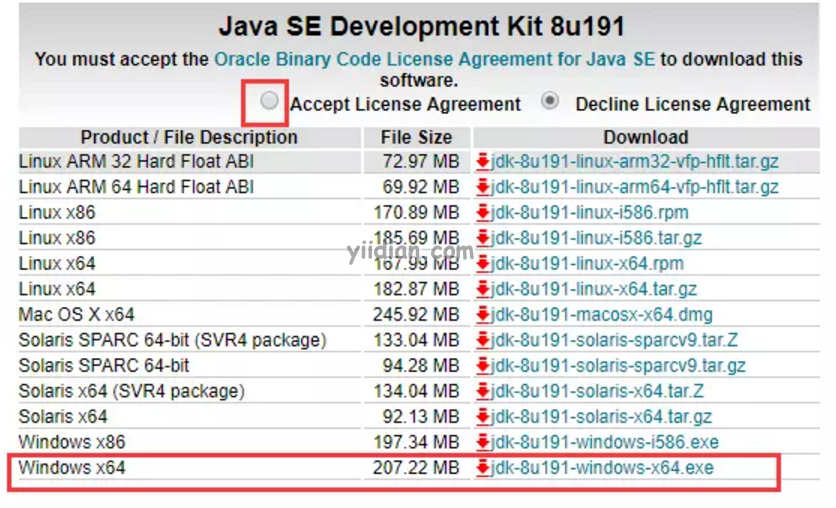
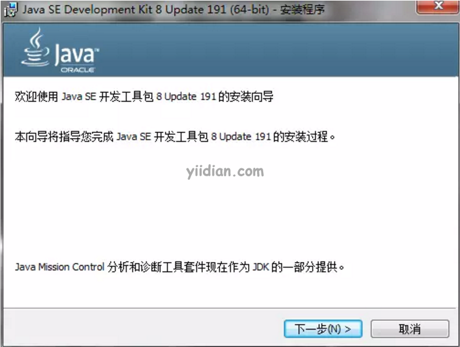
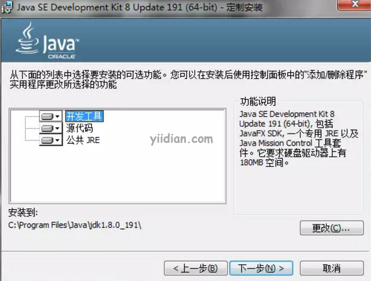
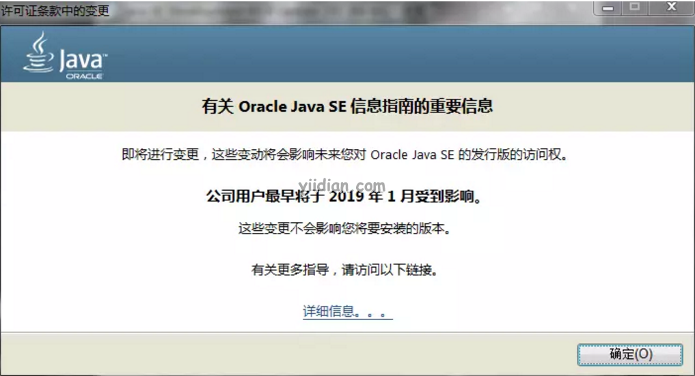
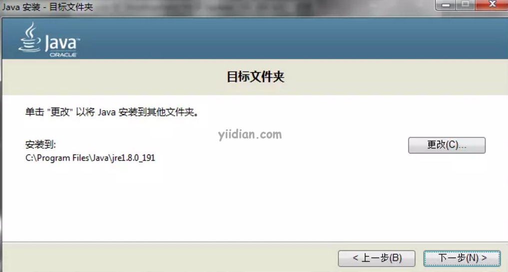
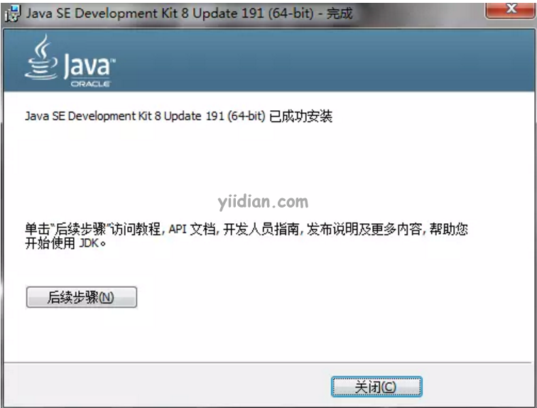
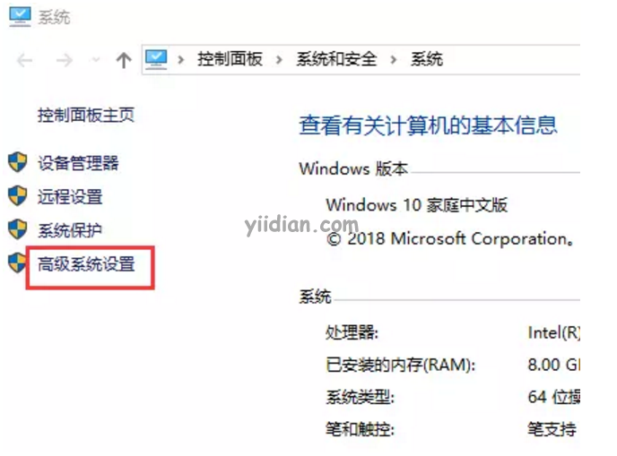
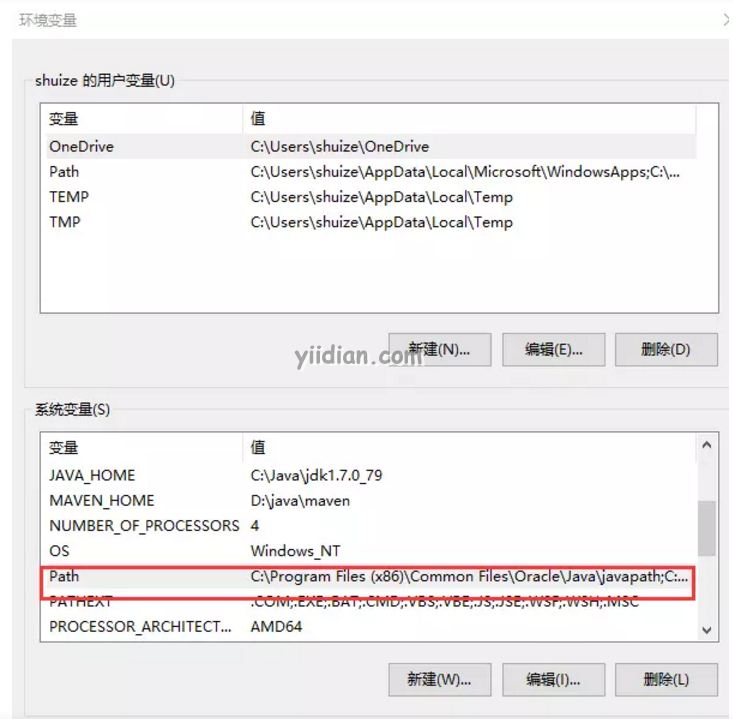

# JDK安装和环境变量配置

## 1 JDK下载

### 1.1 进入下载页面

首先，进入Oracle官网下载页面：https://www.oracle.com/java/technologies/javase/javase8-archive-downloads.html

强烈建议使用JDK1.8的191或者192的小版本，这里就选择8u191，如下图：



### 1.2 选择合适的版本

我们要先选中上方的接受协议，再选择适合自己操作系统的包

我们这里选择最后一个windows64位的安装包，点击红框内右边的jdk-8u191-windows-x64.exe就可以下载了。

## 2 JDK安装

**第一步：**双击下载的exe文件，开始安装。如下图，点击下一步。



**第二步：**选择JDK的安装目录，建议大家尽量安装在C盘或者保持保持默认安装路径（除非你的C盘空间不足）。



**第三步：**直接点击下一步，出现下图的告警信息。

直接点“确定”，继续。



**第四步：**这时又弹出一个窗口，还要选择文件夹，不是安装程序出问题了，仔细看一下，安装的不是JDK，是JRE。JRE是用于运行Java的环境，是JDK的一部分。

如果没有特殊需求，不需要改变安装目录，点击“下一步”



**第五步：**最后，弹窗告诉已成功安装。



## 3 Java环境变量设置

注意，**JDK1.8之后的版本在安装过程中会自动给系统添加Java环境变量**，所以无需配置。JDK1.7或更早版本就需要自行添加环境变量。下面简单介绍如何配置Java的环境变量。

**第一步：**在桌面右击“计算机”图标，选择“属性”。



**第二步：**点击高级系统设置，在“高级”选项卡，点击下方“环境变量”按钮。


**第三步：**通常在PATH这个字段上添加新的环境变量，双击查看



注意：要检查是否已经把您自己的JDK安装目录的`bin目录`配置到PATH中。

```java
javac
或
java -version
```

