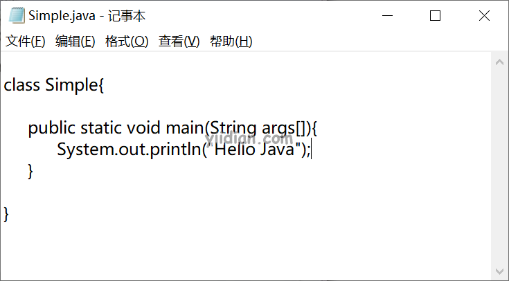

# Java HelloWorld入门

## 1 编写Java代码

要编写Java程序，您需要通过 开始菜单->所有程序->附件->记事本，打开记事本，并编写一个简单Java程序，如下所示：



```java
class Simple{

     public static void main(String args[]){
           System.out.println("Hello Java");
     }
    
}
```

并将上面的内容保存为Simple.java文件，下一步是编译和运行它。

## 2 编译和运行Java代码

要编译并运行上面的Java程序，需要通过 开始菜单->所有程序->附件->命令提示符，打开命令提示符。输入以下命令：


**第一步：**先进入Simple.java文件所在的目录:

```
d:
cd java
```

**第二步：**编译Java类

```bash
javac Simple.java
```

**第三步：**运行Java类

```bash
java Simple
```

**输出结果**：

```
Hello Java
```

## 3 第一个Java程序的关键点

上面的入门程序中涉及一些关键的元素：包括`class`，`public`，`static`，`void`，`main`，`String[]`，`System.out.println()`。

- **class**：这是一个关键字，用于在Java中声明一个类。
- **public**：这是一个关键字，表示公开的访问修饰符。这意味着它对所有人可见。
- **static：**这是是一个关键字。如果我们将任何方法声明为静态方法，则称为静态方法。静态方法的核心优点是，不需要创建对象来调用静态方法。main方法由JVM执行，因此不需要创建对象来调用main方法。这样可以节省内存。
- **void**：是方法的返回类型。意味着它不返回任何值。
- **main**：代表程序的起点。
- **String[] args**：用于命令行参数。我们稍后会学习。
- **System.out.println()**：用于打印输出的语句。System是一个类，out是PrintStream类的对象，println() 是PrintStream类的方法。

## 4 一些语法细节

### 4.1 更改修饰符顺序

把修饰符的顺序改变，并不会改变Java方法的定义。如下：

```java
static public void main(String args[])  
```

### 4.2 main方法参数的不同写法

main方法里面是一个String数组，Java数组中的下标符号可以在类型之后，变量之前或变量之后使用。如下：

```java
public static void main(String[] args)  
public static void main(String []args)  
public static void main(String args[])  
```

也可以通过3个点的形式（可变参数）来为main方法提供args参数，如下：

```java
public static void main(String... args)  
```

### 4.3 类末尾分号可选

在Java中的类的末尾的分号是可选的。

```java
class Simple{

     public static void main(String args[]){
           System.out.println("Hello Java");
     }
    
}; //注意：这个分号可以省略的
```

### 4.4 正确的main方法声明

以下都是合法的main方法声明：

```java
public static void main(String[] args)  
public static void main(String []args)  
public static void main(String args[])  
public static void main(String... args)  
static public void main(String[] args)  
public static final void main(String[] args)  
final public static void main(String[] args)  
final strictfp public static void main(String[] args)  
```

### 4.5 错误的main方法声明

以下是一些错误的main方法声明：

```java
public void main(String[] args)  
static void main(String[] args)  
public void static main(String[] args)  
abstract public static void main(String[] args)  
```

## 5 易错点

当我们在输入javac命令编译Java程序时，可能会出现“javac不是内部或外部命令，也不是可运行的程序”这样的错误提示，如下图：


这是因为没有设置Java的环境变量，我们只要把JDK的bin目录配置到PATH环境变量中就OK了。以下文章参考设置Java环境变量：

[JDK安装和环境变量配置](http://www.yiidian.com/java/jdk-install-env-setup.html)