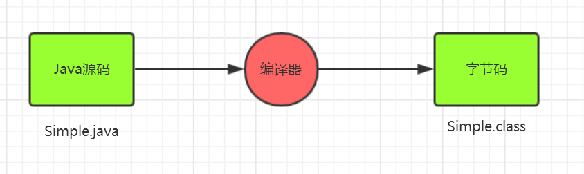
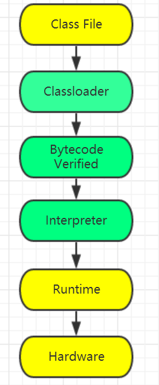
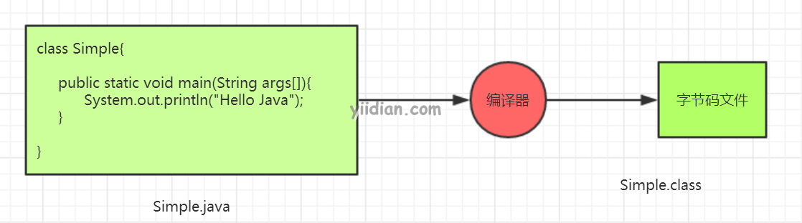
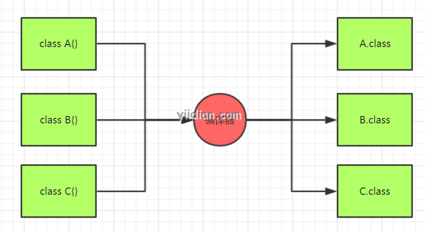

# Java编译运行过程

在[上一篇文章](http://www.yiidian.com/java/java-hello-world.html)中，我们了解了第一个Java入门程序，以及如何编译和运行第一个Java程序。本文主要了解以下编译和运行Java程序时会发生什么。此外，我们还会分析一些常见的问题。

## 1 Java程序编译过程

在编译时，Java文件由Java编译器（它不与底层操作系统交互）将Java代码转换为字节码（.class）。

## 2 Java程序运行过程

在Java程序运行中，会执行以下步骤：

类加载器（Classloader）：类加载器是JVM的子系统，用于加载类文件。
字节码验证程序（Bytecode Verified）：检查代码片段中是否存在可能违反对对象访问权限的非法代码。
解释器（Interpreter）：读取字节码流，然后执行指令。

## 3 两个常见的问题

### 3.1 Java源文件命名方式

问题：一个class的名称为Simple，Java源文件名称可以不是Simple.java么？

答案是可以的，但是前提是该类不是public修饰符。

### 3.2 一个Java源文件写多个类

问题：一个Java源文件中可以写多个类么？

答案是可以的。如下图所示：

