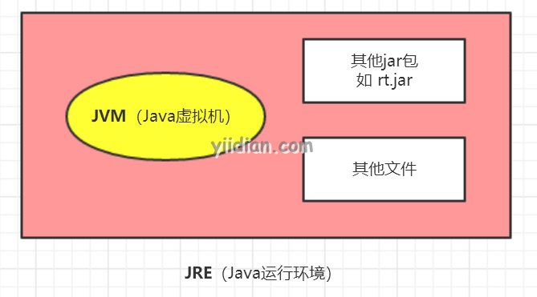
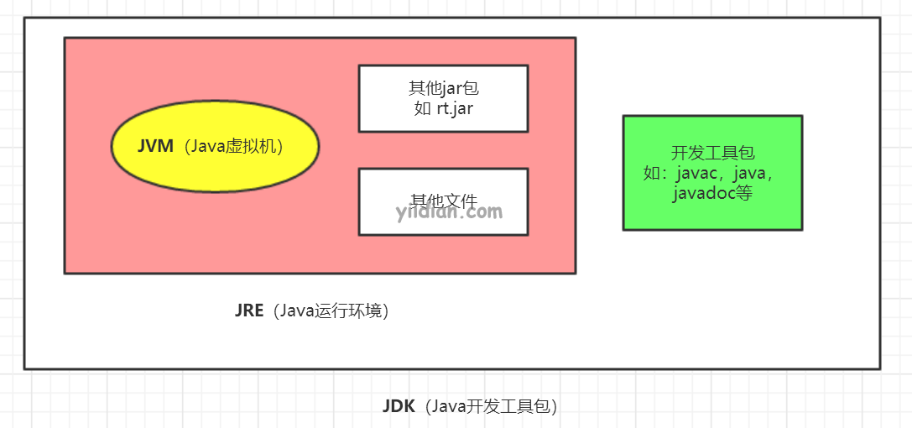

# JDK，JRE和JVM的区别

本文我们来了解JDK，JRE和JVM之间的区别。

## 1 JVM

JVM（Java虚拟机）是抽象机。**JVM也称为虚拟机，是因为它实际上并不存在**。该规范提供了可以执行Java字节码的运行环境。它还可以运行用其他语言编写并编译为Java字节码的程序。

JVM可用于许多硬件和软件平台。JVM，JRE和JDK都必须依赖于操作系统平台，因为每个操作系统的配置都不同。但是，Java是平台无关的。

JVM的主要任务为：

- 加载代码
- 验证代码
- 执行代码
- 提供运行时环境

## 2 JRE

JRE是Java Runtime Environment的首字母缩写。它也称为为Java RTE。Java运行时环境是用于开发Java应用程序的一组软件工具。它用于提供运行时环境。**JRE是JVM的实现**。**它是实际存在的**。它包含JVM在运行时使用的一组库+其他文件。

除了Sun Micro Systems，其他公司也积极发布JVM的实现。

## 3 JDK

JDK是Java Development Kit的首字母缩写。Java Development Kit（JDK）是一个软件开发环境，用于开发Java应用程序和Applet。**它是实际上存在的**。**JDK包含了JRE + 开发工具**。

JDK是Oracle公司发布的下列Java平台的实现：

- Java SE(Java标准版）
- Java EE（Java企业级平台）
- Java ME（微移动平台）

JDK包含一个私有Java虚拟机（JVM）和一些其他资源，例如解释器/加载器（java），编译器（javac），存档器（jar），文档生成器（javadoc）等，以完成Java应用程序的开发。

