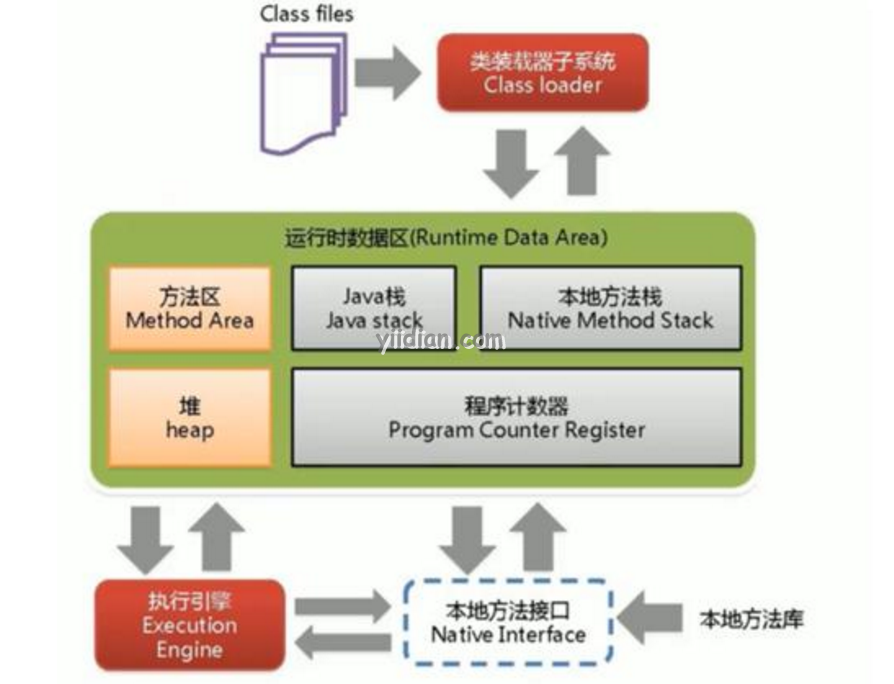

# JVM的体系结构

## 1 什么是JVM

JVM（Java虚拟机）是抽象机。它是提供执行Java字节码的运行时环境的规范。

JVM可用于许多硬件和软件平台（即JVM取决于平台）。

- JVM是一个规范，其中Java虚拟机只是定义了运行Java程序所需要的规范。具体的实现算法由JVM的实现者提供。JVM的实现已由Oracle和其他公司提供。
- JVM的其中一个实现称为JRE（Java运行时环境）。
- 每当在命令提示符下编写Java命令运行Java类时，都会创建JVM实例。

## 2 JVM的作用

以下为JVM的作用：

- 加载代码
- 验证代码
- 执行代码
- 提供运行时环境

JVM还提供了以下功能：

- 记忆区
- 类文件格式
- 寄存器集
- 垃圾回收机制
- 致命错误报告等

## 3 JVM内部架构

让我们了解JVM的内部体系结构。它包含类加载器，内存区域，执行引擎等。



### 3.1 类加载器（Classloader）

Classloader是JVM的子系统，用于加载类文件。每当我们运行Java程序时，它都会由类加载器首先加载。Java中有三个内置的类加载器。

- **Bootstrap ClassLoader（引导类加载器）**：这是第一个类加载器，它是Extension ClassLoader的超类。它加载rt.jar文件，其中包含Java Standard Edition的所有类文件，例如java.lang包类，java.net包类，java.util包类，java.io包类，java.sql包类等。
- **Extension ClassLoader（扩展类加载器）**：这是Bootstrap的子类加载器，是System ClassLoader的父类加载器。它加载位于$JAVA_HOME/jre/lib/ext目录中的jar文件。
- **System/Application ClassLoader（系统/应用程序类加载器）**：这是Extension ClassLoader的子类加载器。它从类路径加载类文件。默认情况下，classpath设置为当前目录。您可以使用“ -cp”或“ -classpath”参数来更改类路径。它也被称为应用程序类加载器。

下面是一个打印类加载器名称的示例：

```java
public class ClassLoaderExample  
{  
    public static void main(String[] args)  
    {  
        //需求：打印当年类所使用的类加载器   
        //System/Application ClassLoader会先加载这个类  
        Class c=ClassLoaderExample.class;  
        System.out.println(c.getClassLoader());  
    
        //String这个类存放在rt.jar文件中，是由Bootstrap ClassLoader加载的
        //如果是Bootstrap ClassLoader类加载器的输出都为null
        System.out.println(String.class.getClassLoader());  
    }  
}     
```

输出结果为：

```
sun.misc.Launcher$AppClassLoader@4e0e2f2a 
null
```

这些是Java提供的内部类加载器。如果要创建自己的类加载器，则需要扩展ClassLoader类。

### 3.2 类（方法）区

类（方法）区存储每个类的结构，例如运行时常量池，字段和方法数据，方法代码。

### 3.3 堆

这是给对象分配的运行时数据区域。

### 3.4 Java栈

Java栈用于保存局部变量和部分结果，并在方法调用和返回中起作用。

每个线程都有一个与该线程同时创建的私有JVM堆栈。

每次调用方法时都会创建一个新框架。框架的方法调用完成后将销毁。

### 3.5 程序计数器

程序计数器包含当前正在执行的Java虚拟机指令的地址。

### 3.6 本地方法栈

它包含应用程序中使用的所有本机方法。

### 3.7 执行引擎

执行引擎包含了：

- 虚拟处理器
- 解释器：读取字节码流，然后执行指令。
- 即时（JIT）编译器：用于提高性能。JIT同时编译字节代码中具有相似功能的部分，从而减少了编译所需的时间。在此，术语“编译器”是指从Java虚拟机（JVM）的指令集到特定CPU的指令集的转换器。

### 3.8 Java本机方法接口

Java本机方法接口（JNI）是一个框架，提供与使用C，C++，Assembly等其他语言编写的另一个应用程序进行通信的接口。Java使用JNI框架将输出发送到控制台或与操作系统库进行交互。